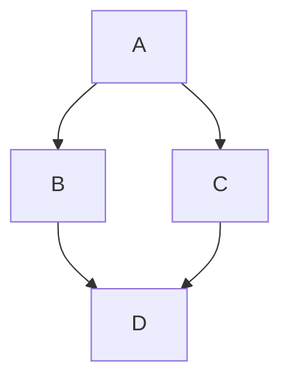

# Govcookiecutter wrappers

This is a wrapper which will zip the needed files from govcookiecutter and govcookiecutter-lite,
and add command line functions to create a new project based on either of these structures.

## Why is this needed?

Some government departments may utilise secure environments where 
connection to github is prohibited and therefore cannot access these templates.
Publishing this wrapper on PyPI should allow for the templates to be installed using `pip`. 

## How this (should) Work

This section is the plan of how the package should work and is subject to change. 

